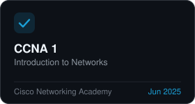
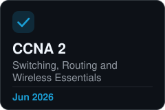
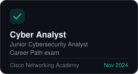
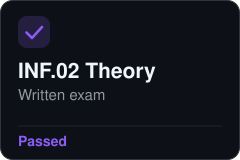
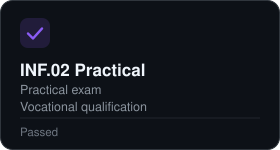

<h1 align="center">Hi, I'm Maksym</h1>

I build websites with HTML, CSS, JavaScript and PHP. 
I like working in a team, and I use AI tools every day to move faster and learn new things.

Graduated from Secondary School No. 1 
Studying Computer Science at a technical school in Poland 
Studying Cybersecurity at a university in Poland

## Skills

  

  
  

## Certificates

<table align="center">
  <tr>
    <td></td>
    <td></td>
    <td></td>
  </tr>
  <tr>
    <td></td>
    <td></td>
    <td></td>
  </tr>
</table>

## Activity

  

## Contacts

  
  
  
  

