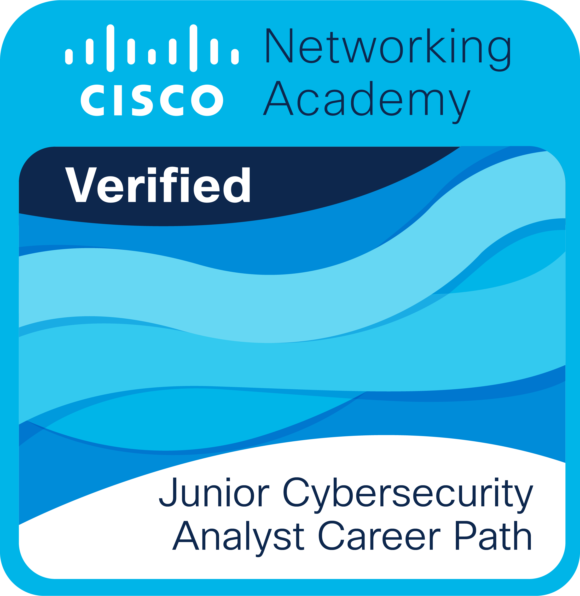
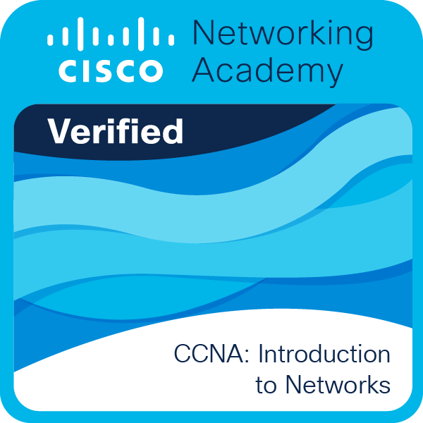
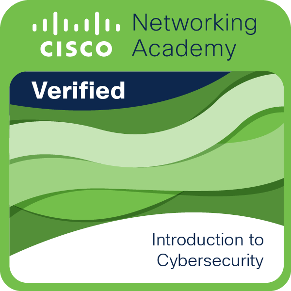

<h1 align="center">Hi, I'm Maksym</h1>

I build websites with HTML, CSS, JavaScript and PHP. 
I like working in a team, and I use <strong>AI tools</strong> every day to move faster and learn new things.

Graduated from Secondary School No. 1 
Studying Computer Science at a technical school in Poland 
Studying Cybersecurity at a university in Poland

## Skills

  

## Hosting & Cloud Platforms

  
  
  
  

### Cloud Infrastructure Experience
- **Oracle Cloud**: Virtual Machines deployment and management
- **Servers Administration**: Configuration, maintenance, and optimization
- **Cloud Infrastructure**: Scaling, networking, and security configurations

## Certificates
<table align="center">
  <tr>
    <td></td>
    <td></td>
    <td></td>
    <td></td>
  </tr>
</table>

## Activity

  

